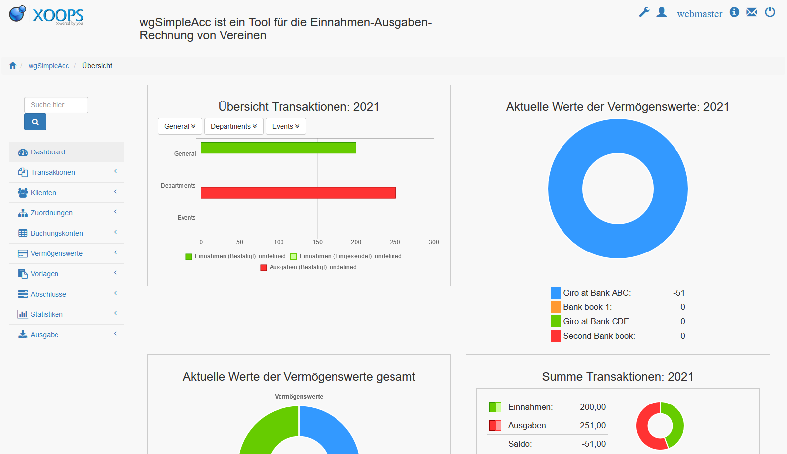

# Deutsch

## wgSimpleAcc Tutorial

### Version: 1.22

### for XOOPS 2.5.11+

### for PHP 7.3 + (PHP 8 ready)

## User Manual

© 2021 The XOOPS Project \(www.xoops.org\)

## Modulinfo

Dieses Modul kann für die Einnahmen-/Ausgabenrechnung von Vereinen und kleinen Unternehmen verwendet werden.

Dieses Modul unterstützt:

* Verwendung von
  * Zuordnungen
  * Vermögenswerten
  * Konten
  * Klienten
  * Steuersätzen
  * Währungen
* Erstellung des Bilanzabschlusses mit wenigen Klicks
* Upload von Dokumenten/Bildern
* Umfassende Rechteverwaltung (Bestätigen, Einsenden, Ansehen)
* Erstellung eigener Ausgabevorlagen
* Visualisierung mit Chartjs

Alle Templates sind voll responsive.

**Dieses Modul funktioniert nur in Kombination mit einem Bootstrap Theme (aktuell bt3) oder du must die Bootstrap-Dateien manuell einbinden.**

## Lizenz:

  
Sofern nicht anders spezifiziert ist der Inhalt lizenziert unter [Creative Commons Attribution-NonCommercial-ShareAlike 4.0 International License](http://creativecommons.org/licenses/by-nc-sa/4.0/).

Alle Derivate sind ein Beitrag zum XOOPS Projekt \(www.xoops.org\)

## Tutorial Version: 1.0

