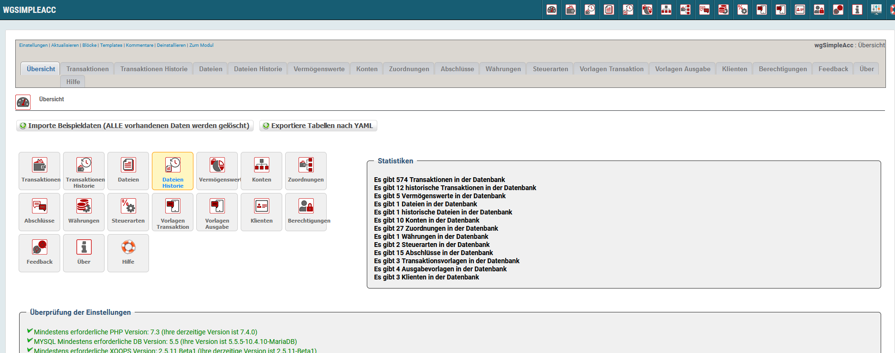

# Administrationmenü

## 1. Menüleiste

Im oberen Bereich befinden sich 7 Menüpunkte.

| Menüpunkt | Funktion |
| :--- | :--- |
| Einstellungen | Hier können sie die Moduleinstellungen vornehmen |
| Update | Klicken sie hier, wenn sie einige Änderungen am Modul vorgenommen haben, Dateien hochgeladen haben usw. - dadurch wird das Modul neu kompiliert und alle Datenbankeinträge werden erneuert |
| Blöcke | Wenn sie hier klicken, werden sie zur Blockverwaltung weitergeleitet, und es werden die Blöcke des aktuelle Modules vorgefiltert |
| Templates | Hier können sie die Standardtemplates des aktuellen Moduls bearbeiten, verwendet wird dabei der XOOPS Template Manager |
| Kommentare | Dieses Modul unterstützt keine Kommentare, sodass sie zum Xoops Kommentar-Manager weitergeleitet werden |
| Deinstallieren | Sie werden zur Deinstallation des Moduls weitergeleitet |
| Zum Modul | Wenn das Modul auf der Benutzerseite sichtbar ist, werden sie dorthin weitergeleitet |

## 2. Dashboard

On the dashboard you get a short overview about the functionalities and the content of the module.

## 3. Funktionalitäten für Administratoren:

* [Transaktionen](transactions.md)
* [Transaktionen Historie](trahistories.md)
* [Dateien](files.md)
* [Dateien Historie](filhistories.md)
* [Vermögenswerte](assets.md)
* [Konten](accounts.md)
* [Zuordungen](allocations.md)
* [Abschlüsse](balances.md)
* [Währungen](currencies.md)
* [Steuern](taxes.md)
* [Vorlagen Transaktion](tratemplates.md)
* [Vorlagen Ausgabe](outtemplates.md)
* [Klienten](clients.md)
* [Permissions](permissions.md)
* [Feedback](feedback.md)
* [Über](about.md)
* [Hilfe](help.md)

