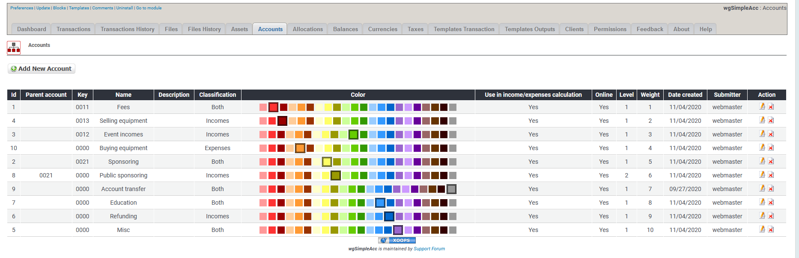

# Konten

## 1. Liste der Konten

In der Liste der Konten findest du alle derzeit existierenden Konten.

Du kannst:

* Konten hinzufügen/bearbeiten
* Konten löschen

## 2. Konten hinzufügen/bearbeiten

Für weitere Details über das Erstellen/bearbeiten von Konten siehe [Konten](../the-user-side/accounts.md)

## 3. Konten löschen

Du kannst zwar Konten löschen, aber **lösche keine Konten die bereits für Transaktionen verwendet werden**. Wenn du Konten nicht weiter verwenden möchtest dann **setze diese auf Offline**.
