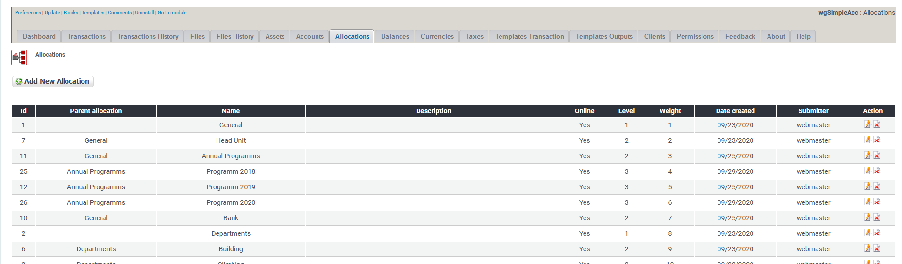

# Zuordnungen

## 1. Liste der Zuordnungen

In der Liste der Zuordnungen findest du alle derzeit existierenden Zuordnungen.

Du kannst:

* Zuordnungen hinzufügen/bearbeiten
* Zuordnungen löschen

## 2. Zuordnungen hinzufügen/bearbeiten

Für weitere Details über das Erstellen/bearbeiten von Zuordnungen siehe [Zuordnungen](../the-user-side/accounts.md)

## 3. Zuordnungen löschen

Du kannst zwar Zuordnungen löschen, aber **lösche keine Zuordnungen die bereits für Transaktionen verwendet werden**. Wenn du Zuordnungen nicht weiter verwenden möchtest dann **setze diese auf Offline**.
