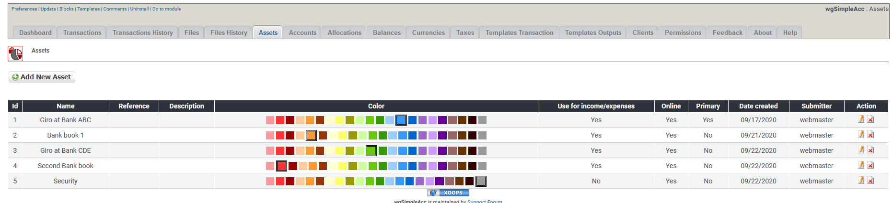

# Vermögenswerte

## 1. Liste der Vermögenswerte

In der Liste der Vermögenswerte findest du alle derzeit existierenden Vermögenswerte.

Du kannst:

* Vermögenswerte hinzufügen/bearbeiten
* Vermögenswerte löschen

## 2. Vermögenswerte hinzufügen/bearbeiten

Für weitere Details über das Erstellen/bearbeiten von Vermögenswerte siehe [Vermögenswerte](../the-user-side/accounts.md)

## 3. Vermögenswerte löschen

 Du kannst zwar Vermögenswerte löschen, aber **lösche keine Vermögenswerte die bereits für Transaktionen verwendet werden**. Wenn du Vermögenswerte nicht weiter verwenden möchtest dann **setze diese auf Offline**.

