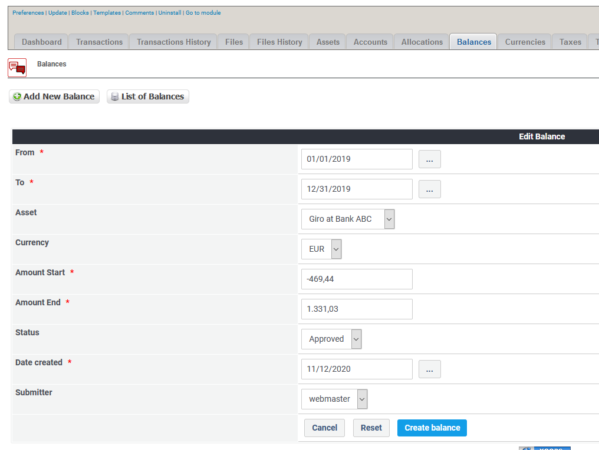

# Abschlüsse

## 1. Liste der Abschlüsse

In der Liste der Abschlüsse findest du alle derzeit existierenden Abschlüsse.

Du kannst:

* Abschlüsse hinzufügen/bearbeiten
* Abschlüsse löschen

## 2. Abschlüsse hinzufügen/bearbeiten

 Du kannst Abschlüsse zwar hier bearbeiten, aber beachte, dass dann die Abschlüsse und die dahinterliegenden Transaktionen vielleicht nicht mehr zusammenpassen.

