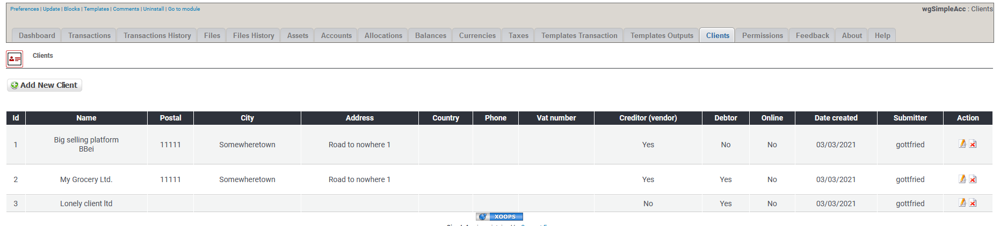

# Klienten

## 1. Liste der Klienten

In der Liste der Klienten findest du alle derzeit existierenden Klienten.

Du kannst:

* Klienten hinzufügen/bearbeiten
* Klienten löschen

## 2. Klienten hinzufügen/bearbeiten

Für weitere Details über das Erstellen/bearbeiten von Klienten siehe [Klienten](../the-user-side/accounts.md)

## 3. Klienten löschen

Du kannst zwar Klienten löschen, aber **lösche keine Klienten die bereits für Transaktionen verwendet werden**. Wenn du Klienten nicht weiter verwenden möchtest dann **setze diese auf Offline**.
