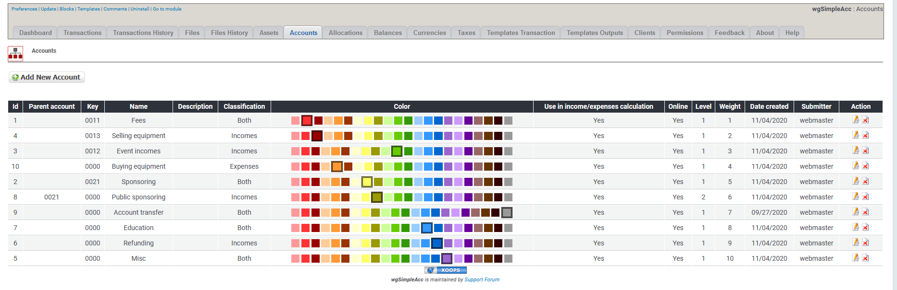
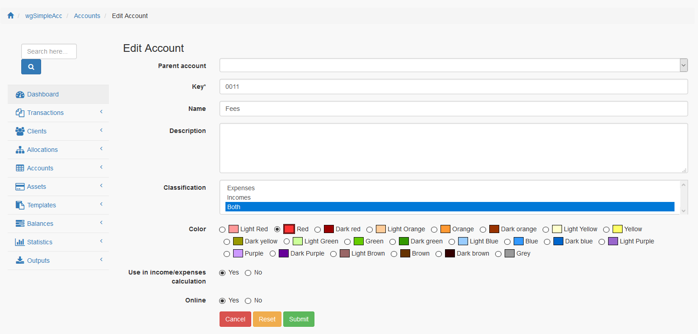

# Währungen

## 1. Liste der Währungen

In der Liste der Währungen findest du alle derzeit existierenden Währungen.

Du kannst:

* Währungen hinzufügen/bearbeiten
* Währungen löschen

## 2. Währungen hinzufügen/bearbeiten

### 2.1. Symbol

Währungssymbol eingeben

### 2.2. Code

Währungscode eingeben

### 2.3. Name

Währungsname eingeben

### 2.4. Primary

Definiere, ob eine Währung als primäre verwendet werden soll. Die primäre Währung wird beim Transaktionsformular vorselektiert.

### 2.5. Online

Du kannst Währungen online oder offline setzen. Nur wenn eine Währung online ist wird sie beim Transaktionsformular angezeigt.

## 3. Währungen löschen

Du kannst zwar Währungen löschen, aber **lösche keine Währungen die bereits für Transaktionen verwendet werden**. Wenn du Währungen nicht weiter verwenden möchtest dann **setze diese auf Offline**.
