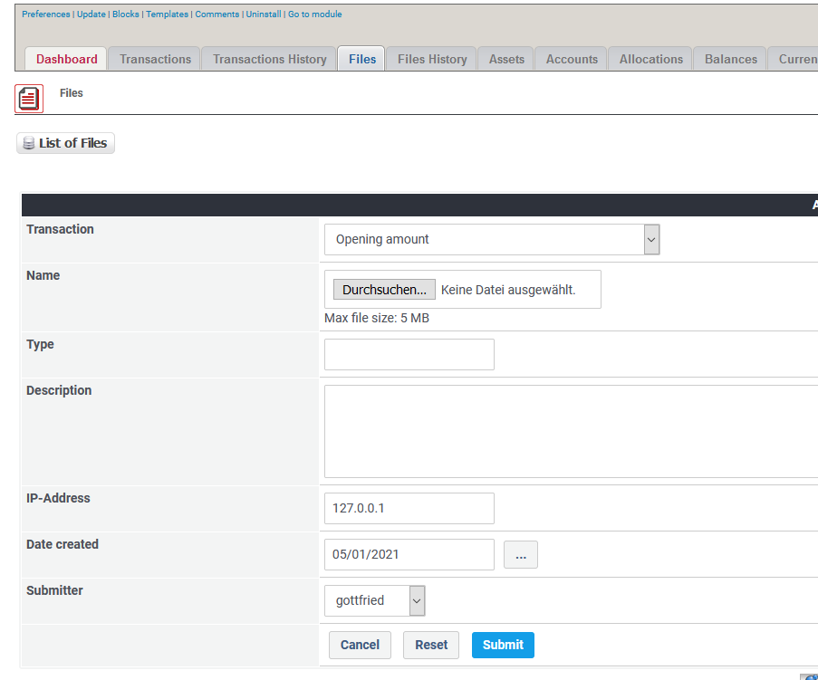

# Dateien

## 1. Liste der Dateien

In der Liste der Dateien findest du alle derzeit existierenden Dateien.

Du kannst:

* Dateien hinzufügen/bearbeiten
* Dateien löschen

## 2. Dateien hinzufügen/bearbeiten

Für weitere Details über das Erstellen/Bearbeiten von Dateien siehe [Transaktionen](../the-user-side/transactions.md)

## 3. Dateien löschen

Du kannst zwar Dateien löschen, aber **es findet dann keine Historisierung statt**.