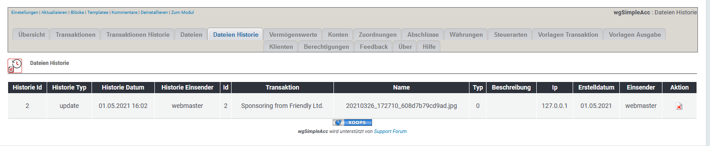

# Historie Dateien

## 1. Liste der Dateien

In der Liste der Dateien findest du alle gelöschten Dateien.

## 2. Dateien löschen

Du kannst die Dateien hier endgültig löschen, aber beachte, dass dann die Historisierung unvollständig ist.
