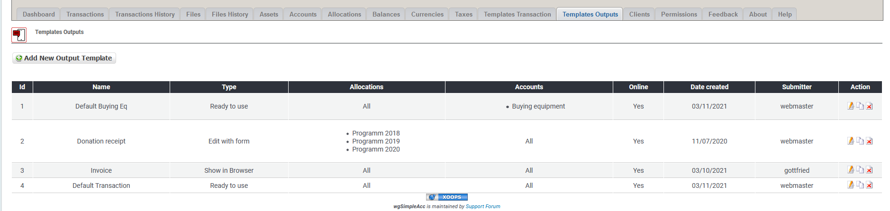
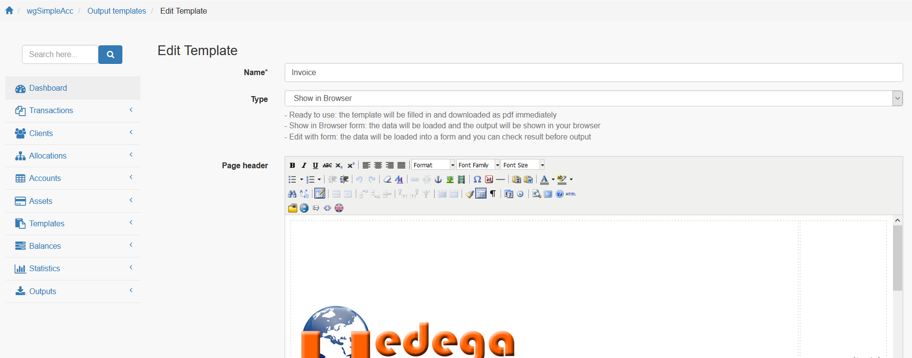

# Ausgabevorlagen

## 1. Liste der Ausgabevorlagen

In der Liste der Ausgabevorlagen findest du alle derzeit existierenden Ausgabevorlagen.

Du kannst:

* Ausgabevorlagen hinzufügen/bearbeiten
* Ausgabevorlagen klonen
* Ausgabevorlagen löschen

## 2. Ausgabevorlagen hinzufügen/bearbeiten

Für weitere Details über das Erstellen/bearbeiten von Ausgabevorlagen siehe [Ausgabevorlagen](../the-user-side/templates.md)

