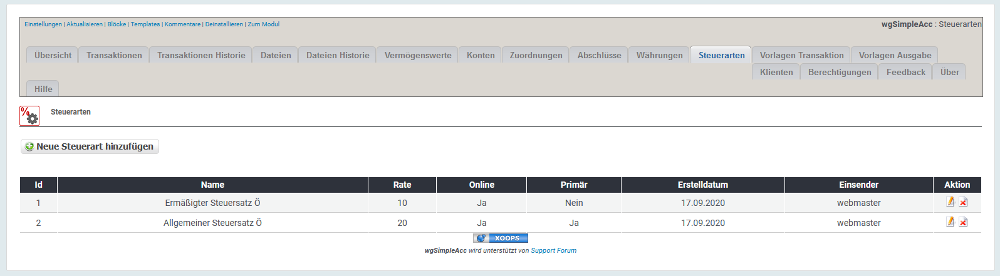
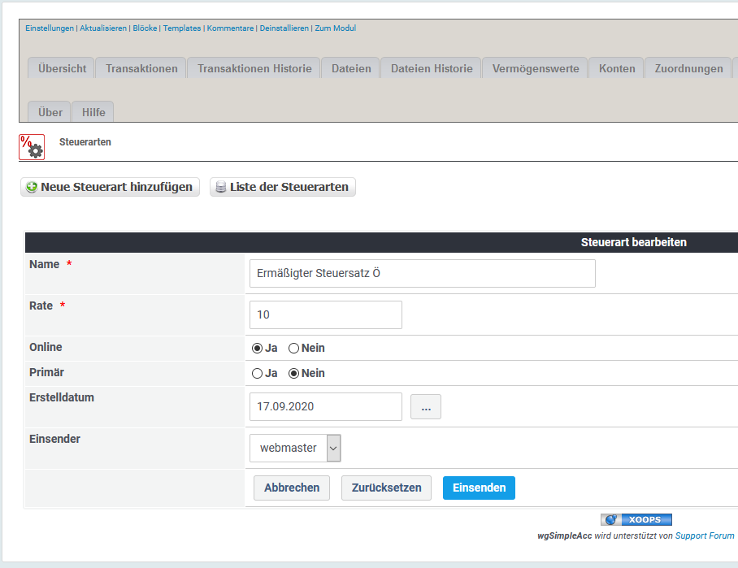

# Steuerarten

## 1. Liste der Steuerarten

In der Liste der Steuerarten findest du alle derzeit existierenden Steuerarten.

Du kannst:

* Steuerarten hinzufügen/bearbeiten
* Steuerarten löschen

## 2. Steuerarten hinzufügen/bearbeiten

### 2.1. Name

Name Steuerart eingeben

### 2.2. Rate

Steuersatz eingeben

### 2.3. Online

Du kannst Steuerarten online oder offline setzen. Nur wenn eine Währung online ist wird sie beim Transaktionsformular angezeigt.

### 2.4. Primary

Definiere, ob eine Steuerart als primäre verwendet werden soll. Die primäre Steuerart wird beim Transaktionsformular vorselektiert.

## 3. Steuerarten löschen

Du kannst zwar Steuerarten löschen, aber **lösche keine Steuerarten die bereits für Transaktionen verwendet werden**. Wenn du Steuerarten nicht weiter verwenden möchtest dann **setze diese auf Offline**.
