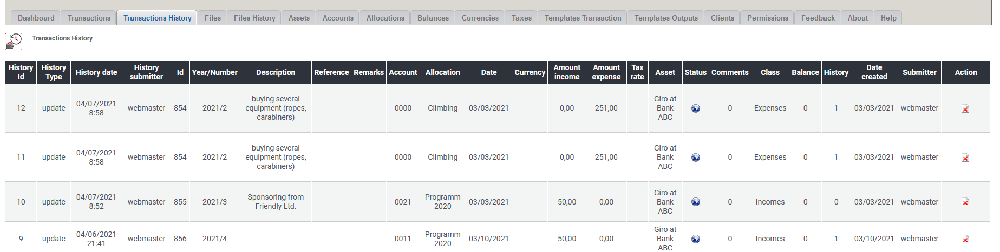

# Historie Transaktionen

## 1. Liste der Transaktionen

In der Liste der Transaktionen findest du alle gelöschten oder bearbeiteten Transaktionen.

## 2. Transaktionen löschen

Du kannst die Dateien hier endgültig löschen, aber beachte, dass im Adminbereich keine Historisierung stattfindet.