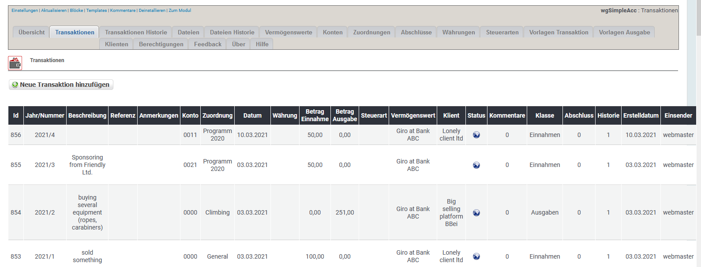
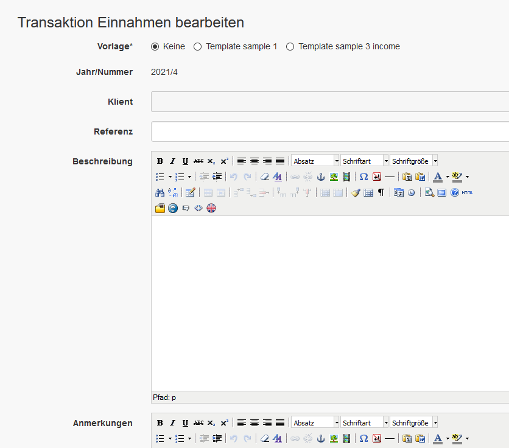

# Transaktionen

## 1. Liste der Transaktionen

In der Liste der Transaktionen findest du alle derzeit existierenden Transaktionen.

Du kannst:

* Transaktionen hinzufügen/bearbeiten
* Transaktionen löschen

## 2. Transaktionen hinzufügen/bearbeiten

Für weitere Details über das Erstellen/bearbeiten von Transaktionen siehe [Transaktionen](../the-user-side/transactions.md).

## 3. Transaktionen löschen

Du kannst zwar Transaktionen löschen, aber **lösche keine Transaktionen die Teil eines Abschlusses sind**.