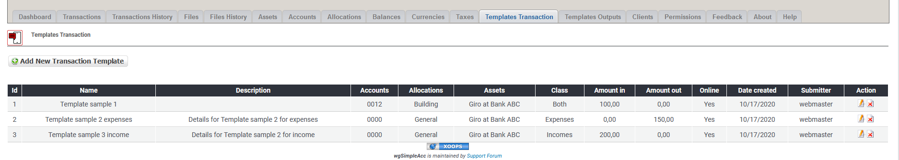

# Transaktionsvorlagen

## 1. Liste der Transaktionsvorlagen

In der Liste der Transaktionsvorlagen findest du alle derzeit existierenden Transaktionsvorlagen.

Du kannst:

* Transaktionsvorlagen hinzufügen/bearbeiten
* Transaktionsvorlagen löschen

## 2. Transaktionsvorlagen hinzufügen/bearbeiten

Für weitere Details über das Erstellen/bearbeiten von Transaktionsvorlagen siehe [Vorlagen](../the-user-side/templates.md).

