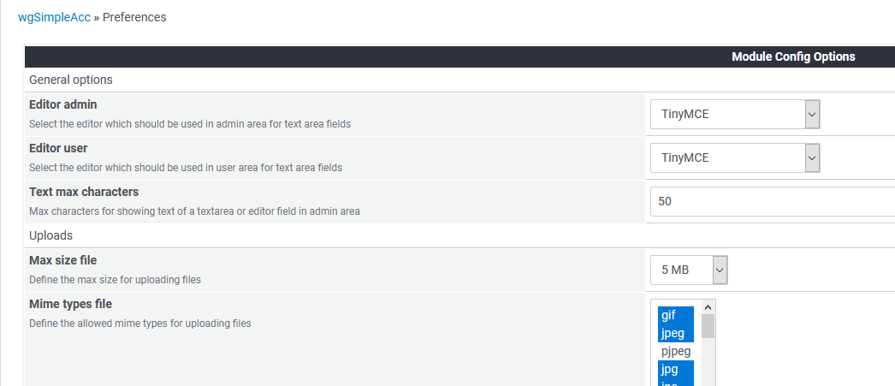

# Einstellungen

In den Moduleinstellungen können Sie zahlreichen Optionen für dieses Modul festlegen:

## Optionen im Detail

* [General options](options-general.md)
* [Optionen für Upload](options-upload.md)
* [Optionen für Anzeige](options-display.md)
* [Optionen für Formate](options-formats.md)
* [Optionen für Indexseite](options-indexpage.md)
* [Optionen für Abschlüsse](options-balances.md)
* [Optionen für Komponenten](options-components.md)
* [Sonstige Optionen](options-misc.md)
