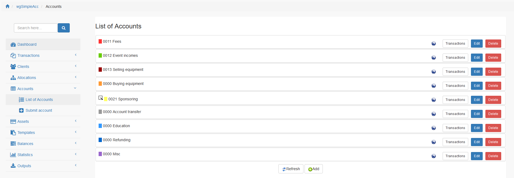
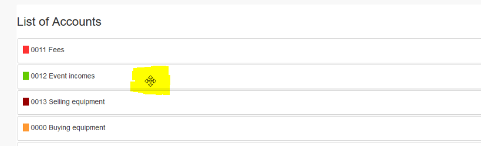
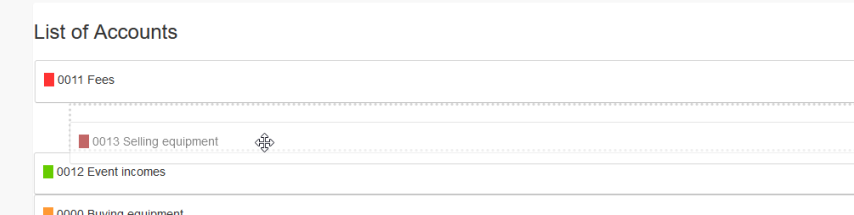

# Konten

## 1. Liste der Konten

In der Liste der Konten findest du alle derzeit existierenden Konten.

Du kannst:

* Konten hinzufügen/bearbeiten
* Transaktionen zu Konten auflisten
* Konten löschen
* Einfaches sortieren der Konten durch Drag&Drop

## 2. Konten hinzufügen/bearbeiten

### 2.1. Übergeordnetes Konto

Du kannst ein übergeordnetes Konto definieren.

### 2.2. Schlüssel

Für ein strukturiertes Kontenverzeichnis kannst du Schlüssel definieren. Du kannst alphanummerische Werte verwenden.

### 2.3. Name

Du kannst einen Kontonamen definieren.

### 2.4. Beschreibung

Du kannst eine zusätzliche Beschreibung definieren.

### 2.4. Klassifizierung

Du kannst definieren ob das Konto für Einnahmen, Ausgaben oder beides verwendet werden soll.
Bei der Erstellung von Transaktionen werden, abhängig von dieser Einstellung, nur relevante Konten angezeigt.

### 2.5. Farbe

Du kannst eine Farbe für das Konto definieren. Diese Farbe wird in den Listen und Charts verwendet.

### 2.6. Verwendung in Einnahmen-/Ausgabenrechnung

Du kannst definieren ob das Konto für die Einnahmen-/Ausgabenrechnung verwendet wird.
Wenn ein Konto deine Einnahmen-/Ausgabenrechnung nicht beeinflussen soll (z.B. bei Bankgarantien) dann setze auf "Nein".

### 2.7. Online

Du kannst ein Konto online oder offline setzen. Nur wenn das Konto online ist dann wird es bei der Erstellung/Bearbeitung von Transaktionen angezeigt.

## 3. Konten löschen

Das Löschen von Konten ist nur möglich wenn es **noch nicht** für Transaktionen verwendet wurde.

## 4. Konten sortieren

Wenn du die Maus über das Konto bewegt wird ändert sich der Mauszeiger und du kannst die Konten durch einfaches Drag&Drop (neu) sortieren.

Du kannst sowohl sortieren als auch das Konto einem anderen als Unterkonto definieren.

