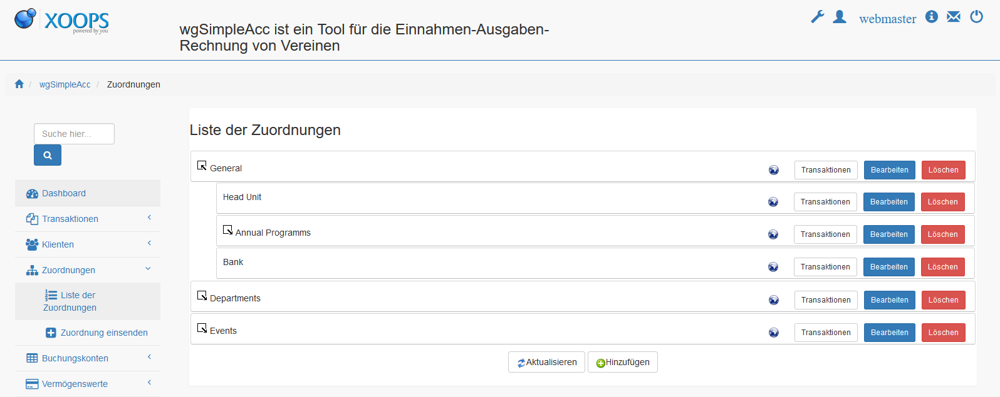
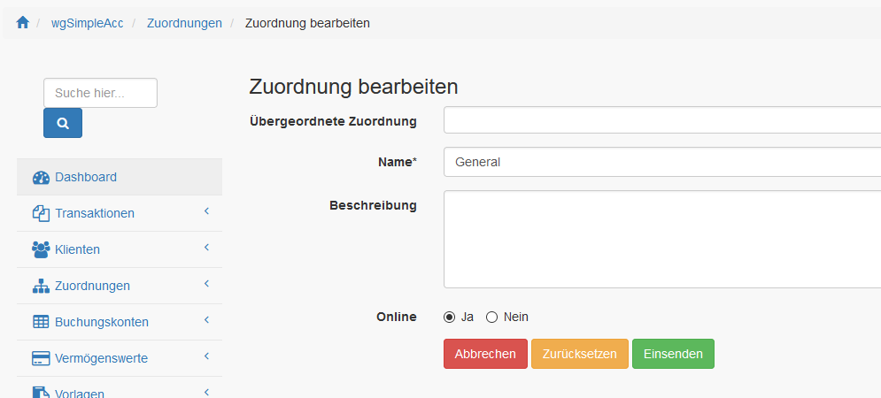

# Zuordnungen

## 1. Liste der Zuordnungen

In der Liste der Zuordnungen findest du alle derzeit existierenden Zuordnungen.

Du kannst:

* Zuordnungen hinzufügen/bearbeiten
* Transaktionen zu Zuordnungen auflisten
* Zuordnungen löschen
* Einfaches sortieren der Zuordnungen durch Drag&Drop

## 2. Zuordnungen hinzufügen/bearbeiten

### 2.1. Übergeordnete Zuordnungen

Du kannst eine übergeordnete Zuordnung definieren.

### 2.2. Name

Du kannst einen Namen definieren.

### 2.3. Beschreibung

Du kannst eine zusätzliche Beschreibung definieren.

### 2.7. Online

Du kannst eine Zuordnung online oder offline setzen. Nur wenn die Zuordnung online ist dann wird es bei der Erstellung/Bearbeitung von Transaktionen angezeigt.

## 3. Zuordnungen löschen

Das Löschen von Zuordnungen ist nur möglich wenn diese **noch nicht** für Transaktionen verwendet wurde.

## 4. Zuordnungen sortieren

Wenn du die Maus über die Zuordnung bewegt wird ändert sich der Mauszeiger und du kannst die Zuordnungen durch einfaches Drag&Drop (neu) sortieren.

Du kannst sowohl sortieren als auch die Zuordnung einem anderen als Unterzuordnung definieren.
