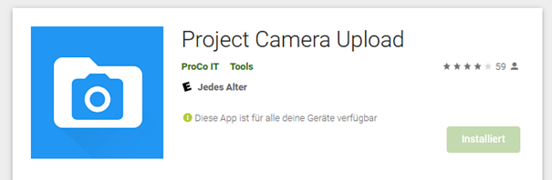

# Dateiupload mit App

Das Kassentool verfügt über die Möglichkeit, dass Anlagen über das Handy direkt in das Kassentool hochgeladen werden. Dazu ist ein am Handy eine entsprechende FTP-App installiert und die Zugangsdaten müssen eingestellt werden.

## 1. Installation am Handy

### 1.1 Auswahl einer App

Auswahl eines FTP-Upload-Programmes für dein Handy über z.B. Google Play Store. Ich verwende Project Camera Upload \(ist aber leider nur in Englisch verfügbar\)

Zugriff der App auf Fotos/Medien zulassen

### 1.2 FTP-Einstellungen

Rechts oben mit  die Einstellungen \(Settings\) öffnen Für den Zugriff sind folgende Einstellungen erforderlich: Default Destination: FTP FTP-Username: your\_username FTP-Passwort: your\_pwd FTP-Server: your\_server FTP-Port: your\_port

## 2 Upload von Fotos zum Kassentools

1\) Start der App „Project Camera“ 2\) Klick auf Kamerasymbol  3\) Beleg/Rechnung fotografieren 4\) Kamera schließen 5\) In der App „Project Camera“ auf „Save“ klicken und der Upload startet 6\) Im Kassentool in der Transaktionsliste bei der gewünschten Transaktion das Hinzufügen starten  7\) Es erscheint das Formular zum Hochladen von Dateien vom Rechner oder zum Zuordnen des zuvor hochgeladenen Bildes  8\) Klick auf „Hochgeladene Dateien“  Bei einem Klick auf den Eintrag unter „Hochgeladene Dateien“ erscheint darunter eine Vorschau des ausgewählten Bildes 9\) Klick auf „Einsenden“ 10\) Das Bild ist nun der entsprechenden Transaktion zugeordnet  11\) Wenn man nun zur Transaktionsliste zurückkehrt, sieht man dort eine gelbe 1  Dies bedeutet, dass für diese Transaktion 1 Anhang vorhanden ist

