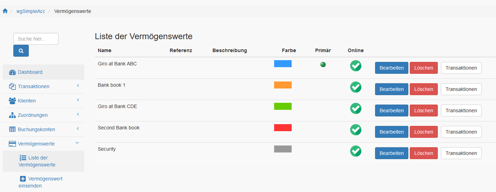
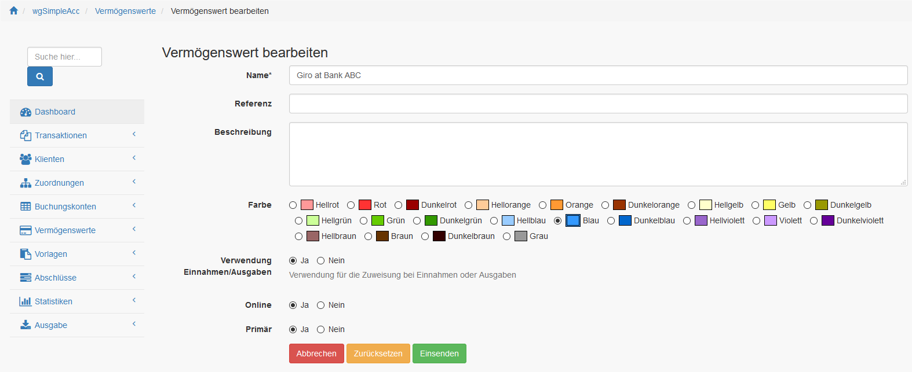

# Vermögenswerte

## 1. Liste der Vermögenswerte

In der Liste der Vermögenswerte findest du alle derzeit existierenden Vermögenswerte.

Du kannst:

* Vermögenswerte hinzufügen/bearbeiten
* Transaktionen zu Vermögenswerte auflisten
* Vermögenswerte löschen

## 2. Vermögenswerte erstellen/bearbeiten

### 2.1. Name

Du kannst einen Namen definieren.

### 2.2. Referenz

Für eine Referenz für den Vermögenswert definieren (z.B. Bankkontonummer). Du kannst alphanummerische Werte verwenden.

### 2.3. Beschreibung

Du kannst eine zusätzliche Beschreibung definieren.

### 2.4. Farbe

Du kannst eine Farbe für den Vermögenswert definieren. Diese Farbe wird in den Listen und Charts verwendet.

### 2.5. Verwendung in Einnahmen-/Ausgabenrechnung

Du kannst definieren ob der Vermögenswert für die Einnahmen-/Ausgabenrechnung verwendet wird.
Wenn ein Vermögenswert deine Einnahmen-/Ausgabenrechnung nicht beeinflussen soll (z.B. bei Bankgarantien) dann setze auf "Nein".

### 2.6. Online
         
Du kannst einen Vermögenswert online oder offline setzen. Nur wenn ein Vermögenswert online ist dann wird es bei der Erstellung/Bearbeitung von Transaktionen angezeigt.

### 2.7. Primär

Du kannst einen Vermögenswert als primär definieren, welche bei der Erstellung einer Transaktion voreingestellt wird.

## 3. Vermögenswerte löschen
      
Das Löschen von Vermögenswerten ist nur möglich wenn es **noch nicht** für Transaktionen verwendet wurde.
