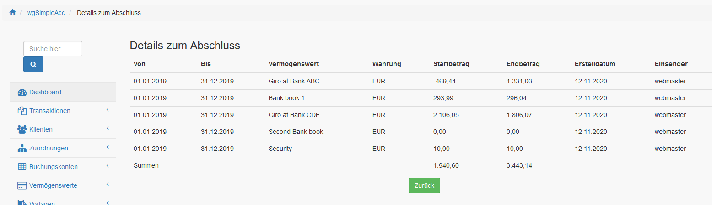
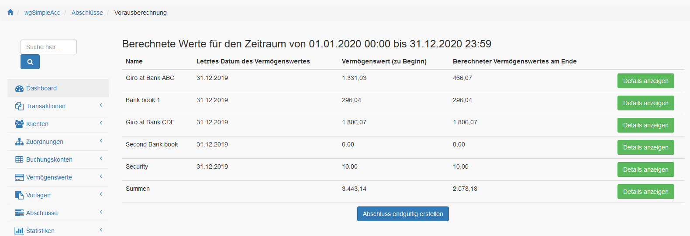

# Abschlüsse

## 1. Liste der Abschlüsse

In der Liste der Abschlüsse findest du alle derzeit existierenden Abschlüsse.

Du kannst die Details zu jedem Abschluss anzeigen, wobei die Berechnung je Vermögenswert angezeigt wird.

## 2. Abschluss erstellen

Definiere die Periode für die der Abschluss erstellt werden soll. Es ist nicht möglich verwendete Zeiträuume ein zweites Mal zu verwenden.

Wenn du auf "Vorausberechnung" klickst dann wird die Berechnung je Vermögenswert für die ausgewählte Periode durchgeführt.

Nach einen Klick "Abschluss balance finally" the balance will be finally stored and all 
transactions linked to this balance will be locked. It isn't possible anymore to edit these transactions.
