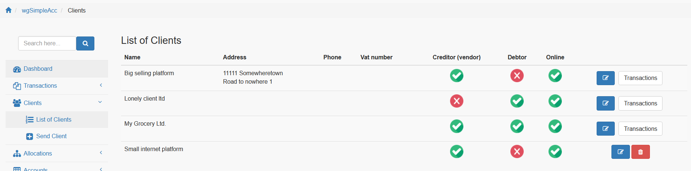
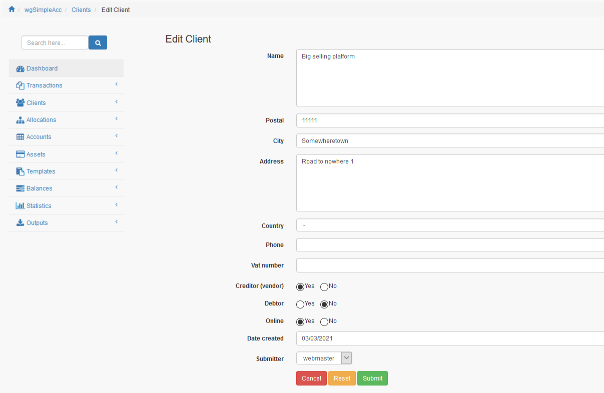

# Klienten

## 1. Liste der Klienten

In der Liste der Klienten findest du alle derzeit existierenden Klienten.

Du kannst:

* Klienten hinzufügen/bearbeiten
* Transaktionen zu Klienten auflisten
* Klienten löschen

## 2. Klienten hinzufügen/bearbeiten

### 2.1. Name und Adresse

Bitte Name und Adresse des Klienten eingeben.

### 2.2. Kreditor

Du kannst hier definieren ob ein Klient ein Kreditor \(Verkäufer\) ist. Wenn du Transaktionen für Ausgaben erfassen willst dann werden nur Kreditoren in der Liste der Klienten angezeigt.

### 2.3. Debitor

Du kannst hier definieren ob ein Klient ein Debitor ist. Wenn du Transaktionen für Einnahmen erfassen willst dann werden nur Debitoren in der Liste der Klienten angezeigt.

### 2.4. Online

Du kannst einen Klienten online oder offline setzen. Nur wenn ein Klient online ist dann wird es bei der Erstellung/Bearbeitung von Transaktionen angezeigt.

## 3. Klienten löschen

Das Löschen von Klienten ist nur möglich wenn es **noch nicht** für Transaktionen verwendet wurde.

