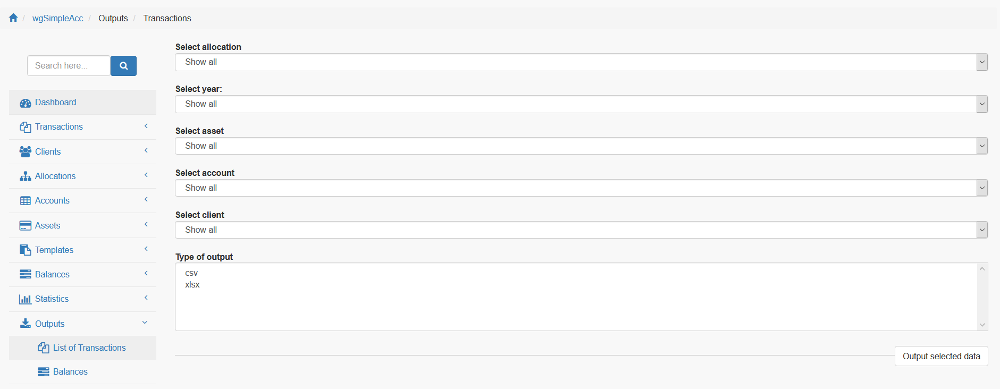

# Ausgaben

## Mögliche Ausgaben

Derzeit kannst du Ausgaben erstellen für:

* Transaktionen
* Abschlüsse

## 2. Transaktionen

Setze den gewünschten Filter und erstelle die Ausgabe als csv oder pdf Datei.

## 2. Abschlüsse

Du kannst mehrere Zeiträume und Vermögenswerte für die Ausgabe auswählen.

Zusätzlich ist die Ausgabe je Zuordnung und/oder Konto für den zuvor ausgewählen Abschluss möglich.
