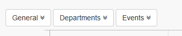
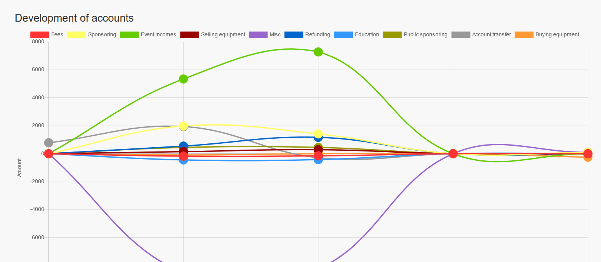
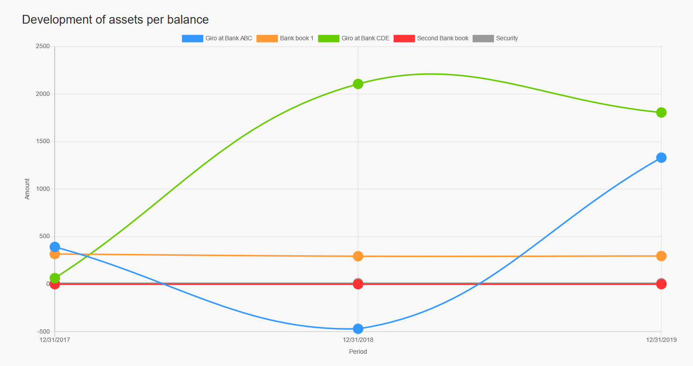

# Statistiken

Auf der Statistikseite werden statistische Informationen in Form von Charts dargestellt.

## 1. Zuordnungen

Auf dem Chart Zuordnungen kannst du die Verteilung betreffend der verschiedenen Zuordnungen anzeigen lassen.

Du kannst auch auf einen speziellen Zeitraum einschränken und/oder direkt zu den Unterzuordnungen durchklicken.

## 2. Vermögenswerte

Auf dem Chart Vermögenswerte kannst du die Verteilung betreffend der verschiedenen Vermögenswerte anzeigen lassen.

Derzeit sind zwei Charts verfügbar:

### 2.1. Aktuelle Werte zu den Vermögenswerten

### 2.2. Entwicklung der Vermögenswerte

## 3. Konten

Auf dem Chart Konten kannst du die Verteilung betreffend der verschiedenen Konten anzeigen lassen.

## 3. Abschlüsse

Auf dem Chart Abschlüsse kannst du die Entwicklung der verschiedenen Abschlüsse je Vermögenswert anzeigen lassen.

