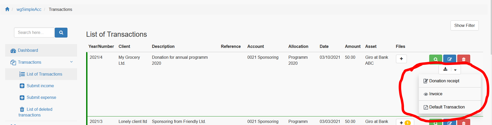

# Vorlagen

In wgSimpleAcc kannst du Vorlagen erstellen für

* Hinzufügen/Bearbeiten von Transaktionen
* Ausgaben


## 1. Transaktionsvorlagen

Wenn du wiederkehrende Transaktionen hast dann kannst du dafür eine Vorlage erstellen.

Du kannst Zuordnungen, Vermögenswerte, Klienten usw. auswählen. Du kannst außerdem defineren, ob die Vorlage für Einnahmen, Ausgaben oder beides verwendet werden soll,


Wenn du eine Transaktionsvorlage erstellt hast dann wirst du diese als ersten Punkt in deinen Eingabeformular für Transaktionen finden.


Wenn du auf den Namen der Vorlage klickst dann werden die Werte im Eingabeformular entsprechenden deiner Vorlage voreingestellt.

## 2. Ausgabevorlagen

Du kannst eigene Ausgabevorlagen erstellen, wie z.B. eine Rechnung.


Die Vorlage wird bei den relevanten Transaktionen auswählbar sein.



### 2.1. Name

Bitte den Namen der Vorlage definieren.

### 2.2. Typ

Es gibt drei Möglichkeiten zur Ausgabe:

* Fertig für Ausgabe: die Vorlage wird ausgefüllt und sofort als Pdf heruntergeladen
* Anzeige im Browser: die Daten werden geladen und das Ergebnis wird in Ihrem Browser angezeigt
* Bearbeiten in Formular: die Daten werden in ein Formular geladen und können vor der Ausgabe überprüft werden

### 2.2. Seitenkopf

Du kannst einen benutzerdefinierten Seitenkopf für die Ausgabe erstellen. Für die Verwendung von Smarty Variablen siehe auch Punkt 2.5.

### 2.3. Inhalt

Du kannst einen benutzerdefinierten Inhalt für die Ausgabe erstellen. Für die Verwendung von Smarty Variablen siehe auch Punkt 2.5.

### 2.4. Seitenfuß

Du kannst einen benutzerdefinierten Seitenfuß für die Ausgabe erstellen. Für die Verwendung von Smarty Variablen siehe auch Punkt 2.5.

### 2.5. Smarty Variable

Dieses Modul verwendet die Xoops Smarty template engine zum Rendern von Ausgaben.

Du kannst verschiedene Variable/Platzhalter für die Transaktionsdaten verwenden, z.B. &lt;{$amount}&gt; wird durch den Transaktionsbetrag ersetzt.

Verfügbare Smarty-Variable sind:

```text
<{$sender}>: Standardabsender für Ausgabe
<{$recipient}>: Empfänger/Klient
<{$year}>: GZ-Jahr der Transaktion
<{$nb}>: GZ-Nummer der Transaktion
<{$year_nb}>: GZ-Jahr/GZ-Nummer der Transaktion (Format: JJJJ/00000)
<{$desc}>: Beschreibung
<{$reference}>: Referenz
<{$account}>: Konto
<{$allocation}>: Zuordnung
<{$asset}>: Vermögenswert
<{$date}>: Transaktionsdatum
<{$amount}>: Betrag
<{$status_text}>: Status
<{$datecreated}>: Erstelldatum
<{$submitter}>: Einsender
```

Zusätzlich sind folgende allgemeine Smarty-Variable verfügbar:

```text
<{$xoops_sitename}>: Name Ihrer Webseite
<{xoops_slogan}>: Slogan Ihrer Webseite
<{$xoops_pagetitle}>: Titel Ihrer Webseite
<{$xoops_url}>: Url Ihrer Webseite (z.B. http://localhost/)
<{$output_date}>: Ausgabedatum
<{$output_user}>: Aktueller Benutzername
```

### 2.6. Zuordnungen

Du kannst definieren ob die Vorlage für alle Transaktionen oder nur für Transaktionen mit speziellen Zuordnungen verfügbar ist.

### 2.7. Konten

Du kannst definieren ob die Vorlage für alle Transaktionen oder nur für Transaktionen mit speziellen Konten verfügbar ist.

### 2.8. Online

Du kannst ein Konto online oder offline setzen wenn du diese z.B. nur während eines bestimmten Monats benötigst. Nur wenn das Konto online ist dann wird es bei der Erstellung/Bearbeitung von Transaktionen angezeigt.

