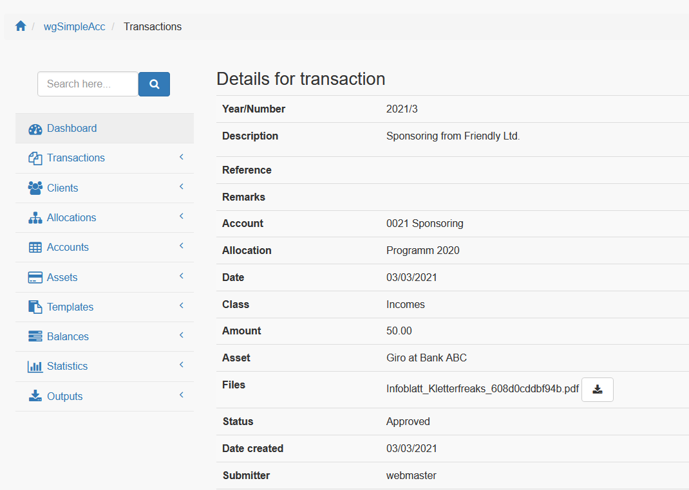
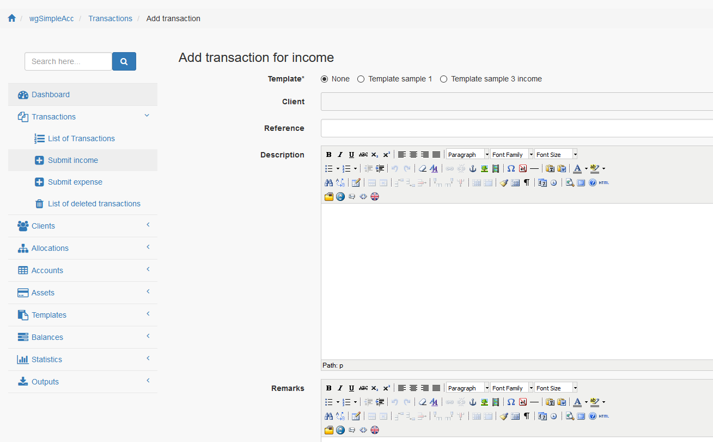

# Transaktionen

## 1. Liste der Transaktionen

In der Liste der Transaktionen findest du alle derzeit existierenden Transaktionen.

Wenn du willst kannst du einen Filter zur Auswahl bestimmter Transaktionen anzeigen/verbergen.

## 2. Aktionen

Entsprechend deiner [Berechtigungen](../administration-menu/permissions.md) hast du folgende Möglichkeiten:

* Transaktionen freigeben
* Details anzeigen
* Hinzufügen/Bearbeiten von Transaktionen \(siehe auch 3. Historisierung\)
* Löschen von Transaktionen \(siehe auch 3. Historisierung\)
* Ausgabe

### 2.1. Transaktionen freigeben

Wenn du ein Benutzer ohne Berechtigung zur Freigabe von Transaktionen bist, dann wird diese Transaktion den Status "Eingesendet" erhalten und ein Benutzer mit der entsprechenden Berechtigung muss die Transaktion zusätzlich freigeben.

Auf Freigabe wartende Transaktionen sind durch eine gelbe Sanduhr gekennzeichnet.

### 2.2. Details anzeigen

Auf der Seite Details werden alle Daten betreffend die Transaktion angezeigt. Außerdem kannst du hier die beigefügten Dateien herunterladen, sofern ein Anhang verfügbar ist.

### 2.3. Hinzufügen/Bearbeiten von Transaktionen

Du kannst Transaktionen mit den verschiedenen Zusatzinformationen zu deinen Kassentool hinzufügen.

#### Vorlage

Wenn du benutzerdefinierte Transaktionsvorlagen verwendest dann kannst du hier eine dieser Vorlagen auswählen und dein Eingabeformular wird entsprechend der Vorlage vorausgefüllt.

#### Klient

Du kannst eine Klienten auswählen, wobei die Verfügbarkeit der Klienten von den [Einstellungen](clients.md) abhängig ist.

Das Dropdown verwendet eine Autovervollständigung, daher kannst du einfach mit dem Eintippen des Namen beginnen,

#### Referenz

Bitte Referenz eintragen, falls gewünscht.

#### Beschreibung

Bitte Beschreibung eintragen, falls gewünscht.

#### Anmerkungen

Bitte Anmerkungen eintragen, falls gewünscht.

#### Konto

Bitte wähle ein Konto mit dem die Transaktion verknüpft werden soll.

#### Zuordnung

Bitte wähle eine Zuordnung mit dem die Transaktion verknüpft werden soll.

#### Klasse

Bitte entscheide, ob eine Transaktion als Einnahme oder als Ausgabe erfasst werden soll.

#### Betrag

Bitte Betrag eingeben.

#### Vermögenswert

Bitte wähle einen Vermögenswert mit dem die Transaktion verknüpft werden soll.

#### Status

Wenn du die entsprechenden Berechtigungen besitzt, dann kannst du entscheiden, ob eine Transaktion als freigegeben oder als eingesendet \(z.B. unbezahlte Rechnung\) erfasst werden soll

### 2.4. Transaktion löschen

Du kannst Transaktionen löschen, aber beachte auch 3. Historisierung.

## 3. Historisierung

Sobald eine Transaktion durch einen Abschluss erfasst ist kannst du diese nicht mehr bearbeiten oder löschen. Solange dies nicht der Fall ist kann die Transaktion auch wieder gelöscht werden.

Zusätzlich kannst du die [Verwendung einer Transaktionshistorie](https://github.com/XoopsDocs/wgsimpleacc-tutorial/tree/c4416050e1ded94d09392e71848a199db2ed7eba/deutsch/administration-menu/preferences.md) aktivieren, sodass deine Kontoführung manipulationssicher wird.

Jede Veränderung einer Transaktion wird in entsprechenden Historie-Tabellen gespeichert.

Gelöschte Transaktionen verbleiben in der Liste der gelöschten Transaktionen.

Wenn eine Transaktion geändert wurde, so kannst du das in den Transaktionsdetails sehen.

Wenn du auf "Details anzeigen" klickst erhältst du die vollständige Historie zu einer Transaktion.

## 4. Dateien

Wenn du die [Verwendung des Dateisystems](https://github.com/XoopsDocs/wgsimpleacc-tutorial/tree/c4416050e1ded94d09392e71848a199db2ed7eba/deutsch/administration-menu/preferences.md) aktiviert hast dann kannst du Dateien zu deiner Transaktion hinzufügen.

Um Dateien hinzuzufügen oder zu löschen klicke bitte auf das "+" Symbol. Wenn bereits Dateianhänge vorhanden sind dann wird die Anzahl der Dateien im Badge angezeigt.

### 4.1. Übersicht Dateien

In der Übersicht wird eine Liste der Anhänge zur Transaktion angezeigt.

Folgende Aktionen sind möglich:

* Download
* Anzeigen
* Bearbeiten
* Löschen

### 4.2. Dateien hochladen

Du kannst, entsprechend den Einstellungen in den [Moduleinstellungen](https://github.com/XoopsDocs/wgsimpleacc-tutorial/tree/c4416050e1ded94d09392e71848a199db2ed7eba/deutsch/administration-menu/preferences.md), Dateien in zwei Arten hochladen.

Die erste Möglichkeit ist der direkte Upload über dieses Formular

Wenn du die [Verwendung einer Upload-App](https://github.com/XoopsDocs/wgsimpleacc-tutorial/tree/c4416050e1ded94d09392e71848a199db2ed7eba/deutsch/administration-menu/preferences.md) aktiviert hast und du eine entsprechende App auf deinem Handy installiert hast \(z.B. Project Camera\) dann wirst du hier die in den Ordner 'uploads/wgsimpleacc/temp/' hochgeladenen Dateien vorfinden und du kannst diese zu deiner Transaktion hinzufügen.

Für weitere Details bitte beachte auch [Upload von Anlagen mittels App](appupload.md).

