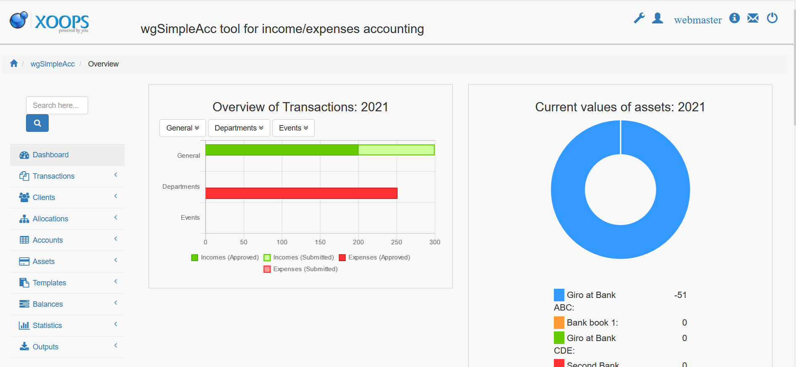

# English

## wgSimpleAcc Tutorial

### Version: 1.22

### for XOOPS 2.5.11+

### for PHP 7.3 + (PHP 8 ready)

## User Manual

© 2021 The XOOPS Project \(www.xoops.org\)

## Module Purpose

The module is used for simple income / expense accounting for clubs or small businesses.

This module supports:

* Use of 
  * allocations
  * assets
  * accounts
  * clients
  * taxes
  * currencies
* Creation of balance with a few clicks
* Upload of documents/images
* Detailed rights management (confirm, send, view)
* Creation of your own output templates
* Visualization with Chartjs

All used templates on user side are fully responsive.

**This module works only in combination with a bootstrap theme (currently bt3) or you have to include bootstrap files manually to your theme.**

## License:

  
Unless specified, this content is licensed under a [Creative Commons Attribution-NonCommercial-ShareAlike 4.0 International License](http://creativecommons.org/licenses/by-nc-sa/4.0/).

All derivative works are to be attributed to XOOPS Project \(www.xoops.org\)

This module is developed by Wedega Webdesign Gabor

## Tutorial Version: 1.0
