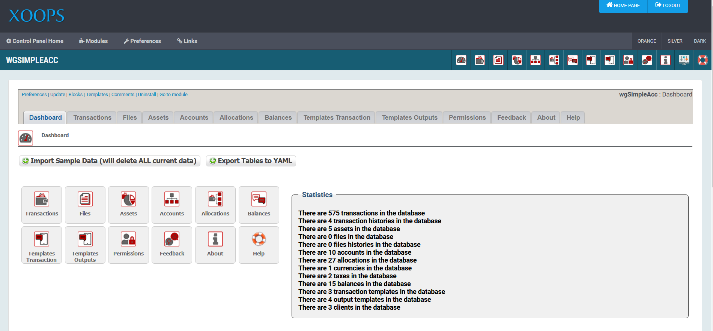

# Administration Menu

## 1. Menu

There are seven \(7\) menu options on top. These can be seen in the graphic below above the Module’s Administration tabs. The menu options available are described in the table below.

| Option | Action |
| :--- | :--- |
| Preferences | Here you can configure your preferences for the module |
| Update | Click here if you’ve made some changes to the module, uploaded new files, etc. – this will recompile the module and update all entries in the database |
| Blocks | When you click here, it will redirect you to the Blocks section of XOOPS, and select the blocks related to your module |
| Templates | Here you can modify the standard module templates using the XOOPS Template manager |
| Comments | This module does not support Comments so the link takes you the XOOPS Comment manager |
| Uninstall | Links to the module uninstall option, the same as clicking the “red arrow” on the module administration page |
| Go to module | If the module is visible on the user side, this will take you there |

## 2. Dashboard

On the dashboard you get a short overview about the functionalities and the content of the module.

## 3. Functionalities for admins:

* [Transactions](transactions.md)
* [Transactions history](trahistories.md)
* [Files](files.md)
* [Files history](filhistories.md)
* [Assets](assets.md)
* [Accounts](accounts.md)
* [Allocations](allocations.md)
* [Balances](balances.md)
* [Currencies](currencies.md)
* [Taxes](taxes.md)
* [Transactions templates](tratemplates.md)
* [Output templates](outtemplates.md)
* [Clients](clients.md)
* [Permissions](permissions.md)
* [Feedback](feedback.md)
* [About](about.md)
* [Help](help.md)

