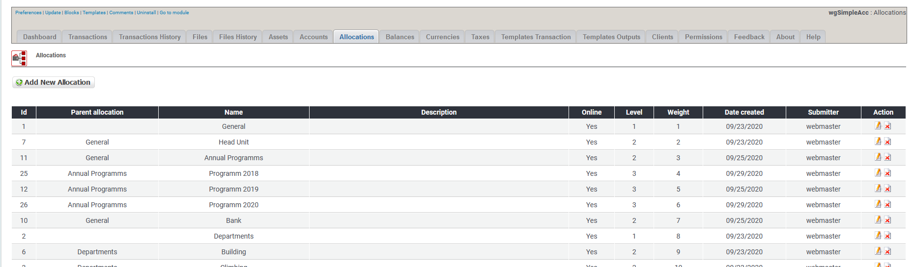

# Allocations

## 1. List of allocations

On the list of allocations you see current existing allocations.

You can:

* Add/edit the allocations
* Delete an allocation

## 2. Add new/edit allocation

For more details about add/edit allocation see [Allocations](../the-user-side/allocations.md)

## 3. Delete allocations

You can delete allocations, but **do not delete allocations which are in use by transactions**. If you no longer want to use an allocations then **set it offline**.
