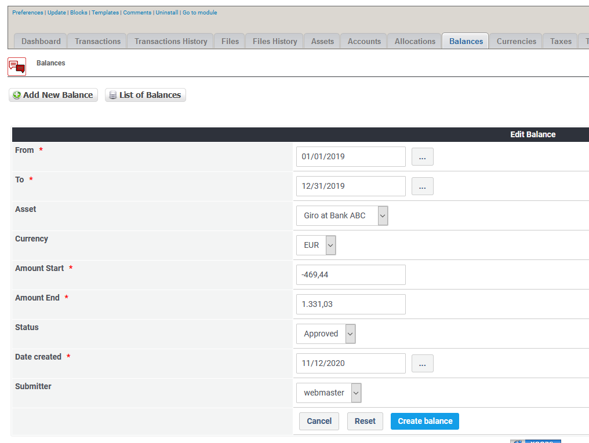

# Balances

## 1. List of balances

On the list of balances you see current existing balances.

You can:

* Add/edit the balances
* Delete an balance

## 2. Add new/edit balance

You can edit balances here, but pay attention, maybe the transactions and the balances are not corresponding anymore.
