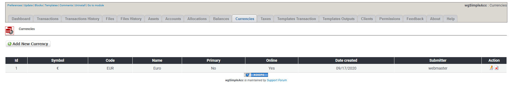
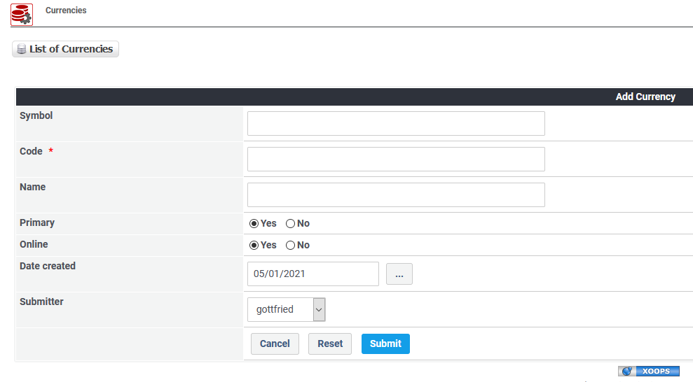

# Currencies

## 1. List of currencies

On the list of currencies you see current existing currencies.

You can:

* Add/edit the currencies
* Delete currencies

## 2. Add new/edit currency

### 2.1. Symbol

Enter the currency symbol

### 2.2. Code

Enter the currency code

### 2.3. Name

Enter the currency name

### 2.4. Primary

Define whether this currency should be your primary currency. The primary currency will be preselected in transaction form.

### 2.5. Online

You can set a currency online or offline. Only if an currency is online then users will see it when adding/editing transactions.

## 3. Delete currencies

You can delete currencies, but **do not delete currencies which are in use by transactions**. If you no longer want to use a currencies then **set it offline**.
