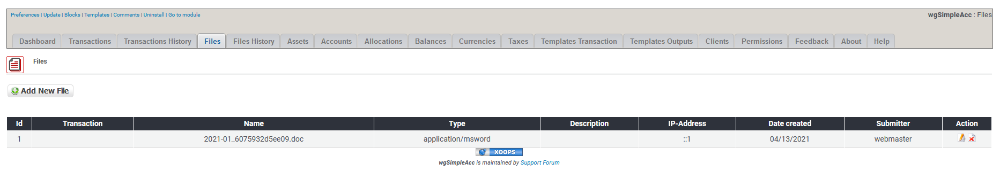
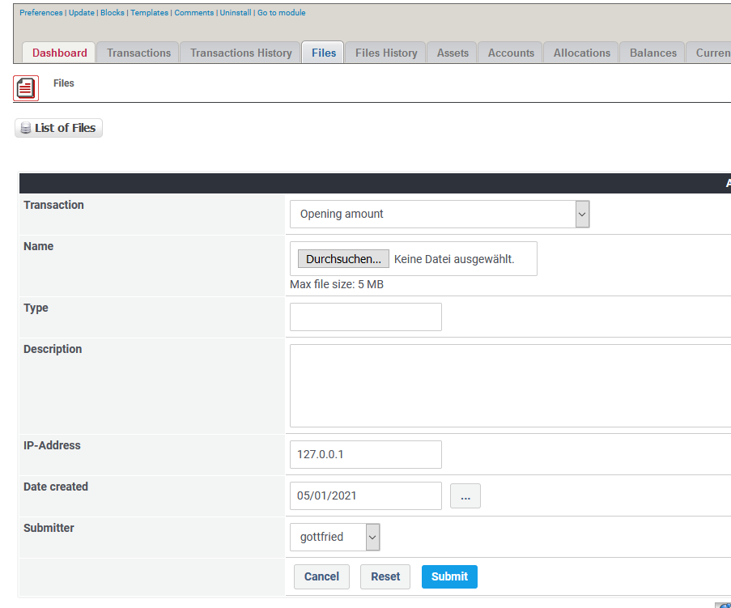

# Files

## 1. List of files

On the list of files you see current existing files.

You can:

* Add/edit the files
* Delete files

## 2. Add new/edit file

For more details about add/edit file see [Transactions](../the-user-side/transactions.md)

## 3. Delete file

You can delete files here, but pay attention, because transaction history log will not be complete at the Admin side.
