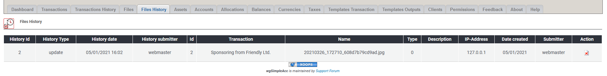

# File histories

## 1. List of files

On the list of files you see deleted files.

## 2. Delete file

You can delete files here, but pay attention, because transaction history log will be incomplete.
