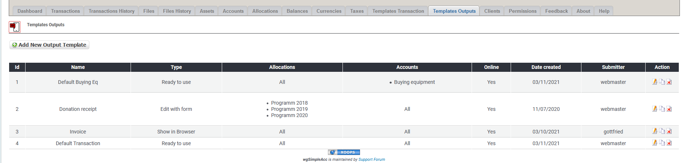
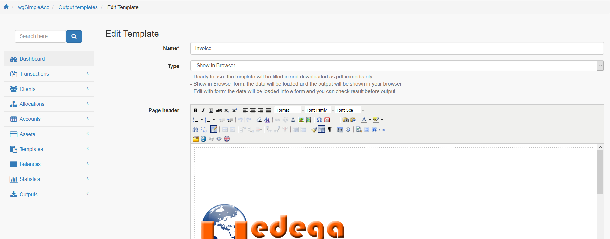

# Output templates

## 1. List of output templates

On the list of output templates you see current existing output templates.

You can:

* Add/edit the output templates
* Clone the output templates
* Delete an output template

## 2. Add new/edit output template

For more details about add/edit output template see [Output templates](../the-user-side/templates.md)
