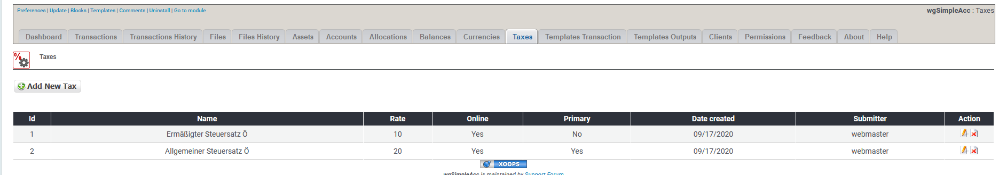
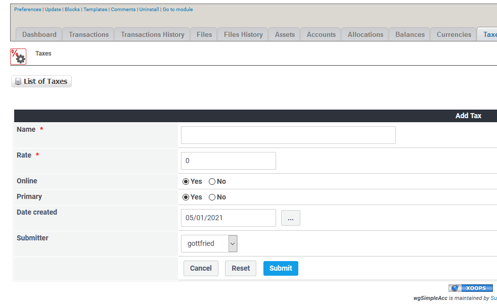

# Taxes

## 1. List of taxes

On the list of taxes you see current existing taxes.

You can:

* Add/edit the taxes
* Delete taxes

## 2. Add new/edit taxe

### 2.1. Name

Enter the tax name

### 2.2. Rate

Enter the tax rate

### 2.3. Online

You can set a tax online or offline. Only if an tax is online then users will see it when adding/editing transactions.

### 2.4. Primary

Define whether this taxe should be your primary tax. The primary tax will be preselected in transaction form.

## 3. Delete taxes

You can delete taxes, but **do not delete taxes which are in use by transactions**. If you no longer want to use a taxes then **set it offline**.

