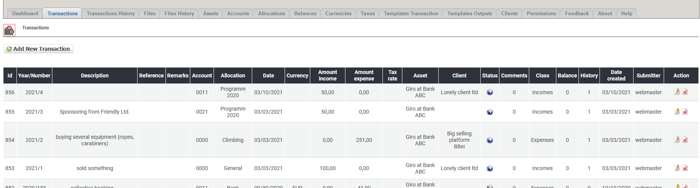

# Transactions

## 1. List of transactions

On the list of transactions you see current existing transactions.

You can:

* Add/edit the transactions
* Delete an transaction

## 2. Add new/edit transaction

For more details about add/edit transaction see [Transactions](../the-user-side/transactions.md).

## 3. Delete transactions

You can delete transactions, but **do not delete taxes which are part of a balance**.