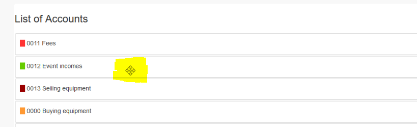
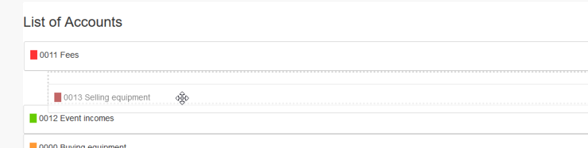

# Accounts

## 1. List of accounts

On the list of accounts you see current existing accounts.

You can:

* Add/edit the accounts
* List transactions for the account
* Delete an account
* Sort the accounts simply by drag&drop

## 2. Add new/edit account

### 2.1. Parent account

You can define a parent account.

### 2.2. Key

You can define a key for your account in order to get a "structure" in your accounts. You can use alphanumeric values.

### 2.3. Name

You can define a name for your account.

### 2.4. Description

You can define an additional description for your account.

### 2.4. Classification

You can define, whether the account can be used for incomes, expenses or both.
In the creation of transactions you will get, depending on this setting, only relevant accounts.

### 2.5. Color

You can define a color for your account. This color will be used in lists and charts.

### 2.6. Use in income/expenses calculation

You can define whether an account should be used for income/expenses calculation.
If a booking on the account should not influence your calculation (e.g. bank garanties) then set to "NO".

### 2.7. Online

You can set an account online or offline. Only if an account is online then users will see it when adding/editing transactions.

## 3. Delete an account

Deleting an account is only possible if **it is not used** for transactions.

## 4. Sort account

When you move your mouse over an account the mouse point will change and you can (re)sort the accounts simply by drag&drop.

You can sort or also add an account as a child of another account.

