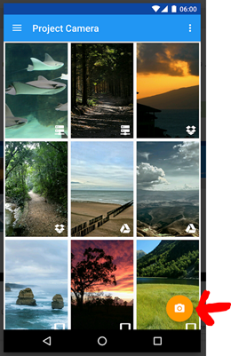
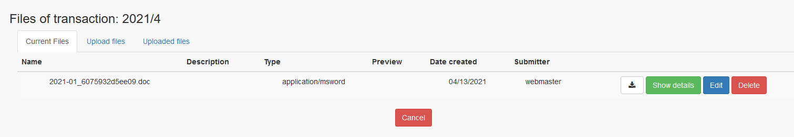

# wgSimpleAcc - Upload of attachments with App

wgSimpleAcc offers the possibility that files kann be uploaded directly to wgSimpleAcc. In order to enable this feature you have to install a ftp-app and you have to set the access data.

## 1. Installation on Handy
### 1.1 Select an App
Select a FTP-Fileupload-App for your device, e.g. via Google Play Store.
I use "Project Camera Upload"

Allow that the app gets access to images/media.

### 1.2 FTP-Settings
Open on top right  the settings
For access in my app I need following settings:
Default Destination:	FTP
FTP-Username:	your_username
FTP-Passwort:	your_pwd
FTP-Server:	your_server
FTP-Port:	your_port

## 2 Upload images to wgSimpleAcc
1)	Start App „Project Camera“
2)	Click on camera symbol
      
3)	Take a photo of the bill/document
4)	Close camera
5)	In the app „Project Camera“ click on „Save“ and upload starts
6)	On wgSimpleAcc you can start adding the file to the transaction you want by clicking on "+"
      
7)	The form for uploading or adding a file to your transaction opens
      
8)	Click on „Uploaded files“
      
If you click on an item of the list "Uploaded files" you get a preview of the image.
9)	Click on „Submit“
10)	The image is now attached to your transaction
       
11)	If you go back to transaction list you see now a yellow badge with 1
       
This means that one attachment is available for this transaction.
       