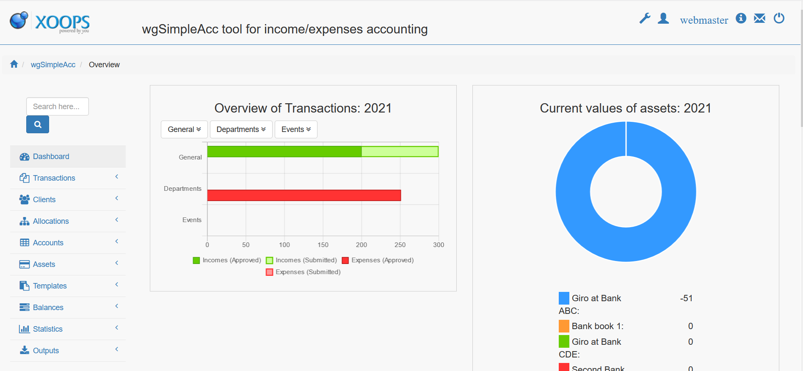

# Index page

On the main page of wgSimpleAcc you get an overview about your transactions and assets.

For changing the content of your dashboard please check [module preferences](../administration-menu/preferences.md).

## Navigation tree

Depending on your [permissions](../administration-menu/permissions.md) you will see all or limited number of nav items

* [Dashboard](../the-user-side/index-page.md)
* [Transactions](../the-user-side/transactions.md)
* [Clients](../the-user-side/clients.md)
* [Allocations](../the-user-side/allocations.md)
* [Accounts](../the-user-side/accounts.md)
* [Assets](../the-user-side/assets.md)
* [Templates](../the-user-side/templates.md)
* [Balances](../the-user-side/balances.md)
* [Statistics](../the-user-side/statistics.md)
* [Outputs](../the-user-side/outputs.md)

