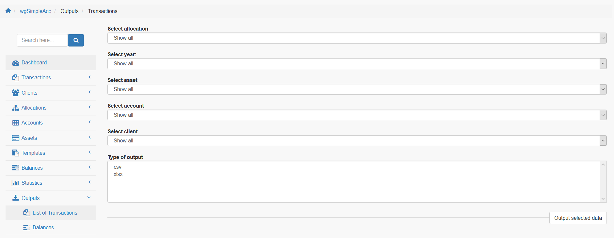
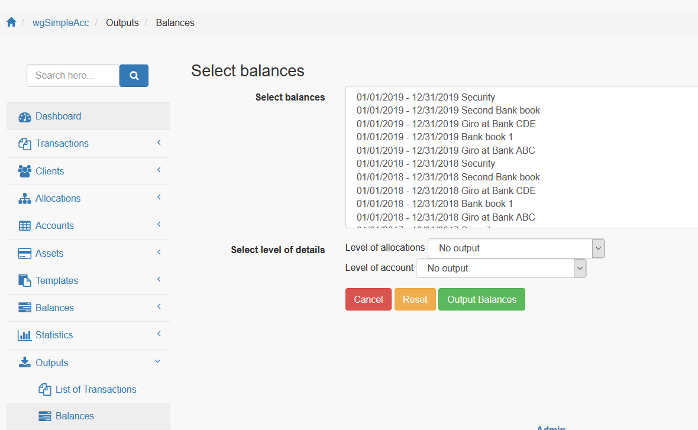

# Outputs

## Possible outputs

Currently you can create an output for:

* transactions
* balances

## 2. Transactions

Set your filter according your wishes and create output as csv or pdf file.

## 2. Balances

You can select multiple periods and assets for output.

Additionally you can put out details for allocations or accounts linked to the previous selected balances.
