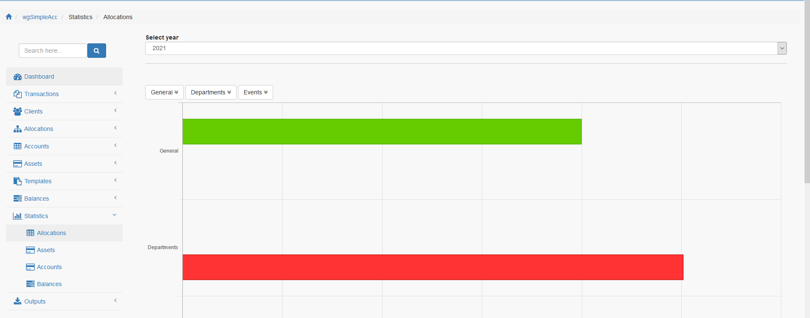
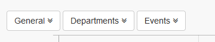
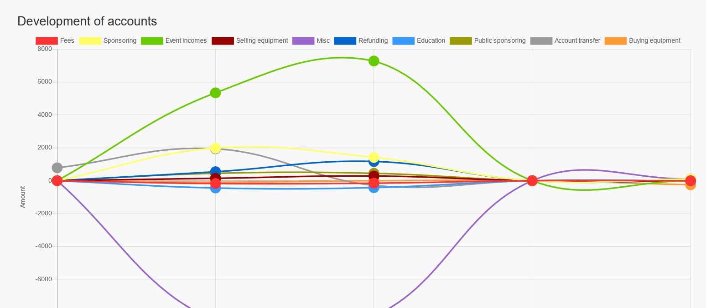
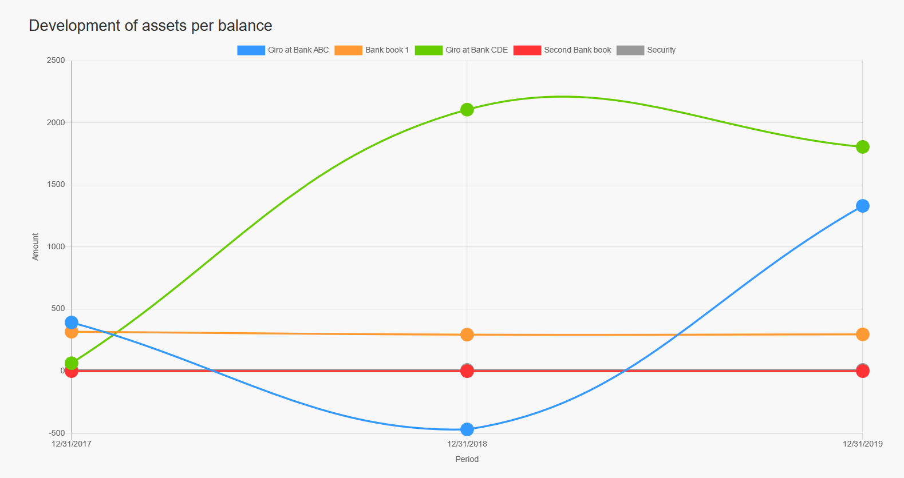

# Statistics

On statistics page you get statistic data presented in charts.

## 1. Allocations

On allocation chart you can see the distribution concerning the different allocation.

You can select a specific period and/or you can drill through to sub allocations.

## 2. Assets

On assets chart you can see the distribution concerning the different assets. 

Currently two charts are available:

### 2.1. Current values of the assets

### 2.2. Development of the assets

## 3. Accounts

On accounts chart you can see the development concerning the different accounts. 

## 3. Balances

On balances chart you can see the development if the different balanced assets. 

