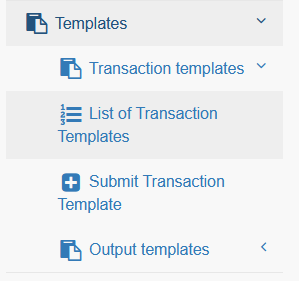

# Templates

In wgSimpleAcc you can create templates for 

* adding/editing transactions
* outputs

## 1. Transaction templates

If you have recurring transactions then you can create templates for them.

You can select allocation, asset, client and so on. You can also define whether this template is only for incomes, expenses or both.

When you create/edit a transaction then you will find your template name on the top of transactions form.

By clicking on the name the transaction form will be prefilled with the values from your template.

## 2. Output templates

You can create your own output templates, e.g. for invoice.

The template will be selectable for the relevant transactions

### 2.1. Name

Please define a name for your template.

### 2.2. Type

There are three possibilites for outputs:

* Ready to use: the template will be filled in and downloaded as pdf immediately
* Show in Browser form: the data will be loaded and the output will be shown in your browser
* Edit with form: the data will be loaded into a form and you can check result before output

### 2.2. Page header

You can create a custom header for your output file. Concerning smarty variables see also 2.5. Smarty variables

### 2.3. Content

You can create a custom content for your output file. Concerning smarty variables see also 2.5. Smarty variables.

### 2.4. Page footer

You can create a custom footer for your output file. Concerning smarty variables see also 2.5. Smarty variables.

### 2.5. Smarty variables

This module uses the Xoops Smarty template engine to render the output.
You can use various variables for transaction data, e.g. <{$amount}> will be replaced by the transaction amount

Available smarty-vars for transactions are: 
    
    <{$sender}>: Default sender for output
    <{$recipient}>: Recipient/Client
    <{year}>: transaction registration year
    <{nb}>: transaction registration year
    <{$year_nb}>: Registration year/number of transaction (Format: YYYY/00000)
    <{$desc}>: Description
    <{$reference}>: Reference
    <{$account}>: Account
    <{$allocation}>: Allocation
    <{$asset}>: Asset
    <{$date}>: Transaction date
    <{$amount}>: Amount
    <{$status_text}>: Status
    <{$datecreated}>: Date created
    <{$submitter}>: Submitter

Additionally there are general smarty-vars available:

    <{$xoops_sitename}>: The website name
    <{xoops_slogan}>: Slogan of website
    <{$xoops_pagetitle}>: The page title
    <{$xoops_url}>: The site main url (e.g. http://localhost/)
    <{$output_date}>: Date output
    <{$output_user}>: Current user name

### 2.6. Allocations

You can define whether a template is available for all transactions or only for transactions with a specific allocation.

### 2.7. Accounts

You can define whether a template is available for all transactions or only for transactions with a specific account.

### 2.8. Online

You can set a template online or offline, e.g. if you need it only for one month in a year. Only if a template is online then users will see it in the list of transactions.
