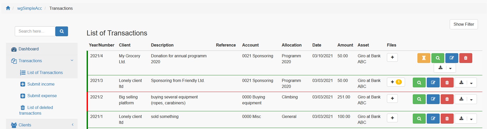
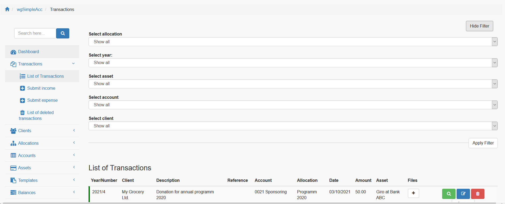
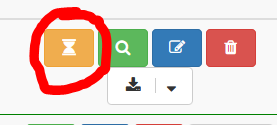

# Transactions

## 1. List of transactions

On the list of transactions you get the most important information about the last transactions.

If you want you can show/hide a filter form for selecting specific transactions.

## 2. Actions

Depending on your [permissions](../administration-menu/permissions.md) you will have following possibilities:

* approve transaction
* show details
* add/edit transaction (see also 3. Transaction History)
* delete transaction (see also 3. Transaction Historyn)
* output

### 2.1. Approve transaction

If a user without permission for approving a transaction is sending a new transaction, this transaction will get status "Submitted" and another user with the right to approve has additionally to approve this transactions.

Transactions waiting for approval are marked with an hourglass.

### 2.2. Show details

On page details you can see all details for a transaction. Additionally you can download/open files, if there are attachments available for this transaction.

### 2.3. Add/edit transaction

You can add transactions with several additional information to you accounting system.

#### Template

If you have created transaction templates you can select one of these templates and the form will be prefilled by data of template.

#### Client

You can select one of the clients depending on the [settings of the client](clients.md)

The dropdown is using autocomplete there fore only start typing the name.

#### Reference

Enter a reference if you want.

#### Description

Enter a description if you want.

#### Remarks

Enter remarks if you want.

#### Account

Please select an account to which this transaction should be linked.

#### Allocation

Please select an allocation to which this transaction should be linked.

#### Class
Please decide whether this transaction should be an expenses or an income.

#### Amount

Enter the amount.

#### Asset

Please select an asset to which this transaction should be linked.

#### Status

If you have the permission to approve then you can decide whether a transaction should be approved or only submitted (e.g. unpaid invoice).

### 2.4. Delete transaction

You can delete transactions, but see also 3. Transaction History.

## 3. Transaction History

If a transaction is covered by a balance you are not allowed anymore to edit or delete it. If it is not balanced you can delete the transaction.

Aditionally you can activate [Use transaction histories](../administration-menu/preferences.md), then your accounting will be tamper-proof

Every change of a transaction will be stored in a history table.

Deleted transactions will remain in the list of deleted transactions.

If you have changed a transaction you can see it in the transaction details

If you click on "Show details" you get the full history of this transaction

## 4. Files

If you have activated [Use file system](../administration-menu/preferences.md) then you can attach files to transactions.

In order to attach or delete a file click on the "+" symbol. If there are already files attached then you can see the number of files in the badge.

### 4.1. Overview files

In the overview you see the list of all files for this transaction

Following actions are possible:

* download
* show
* edit
* delete

### 4.2. Files upload

You can, depending on your settings in [preferences](../administration-menu/preferences.md), upload files in two ways.

First possibility is to upload via this form

If you have activated [Use file upload app](../administration-menu/preferences.md) and you are using a file upload app (e.g. Project Camera) then
you will find here the uploaded files of folder 'uploads/wgsimpleacc/temp/' and so can add this files to current transaction.

For further details please see also [Upload of attachments with App](appupload.md).
